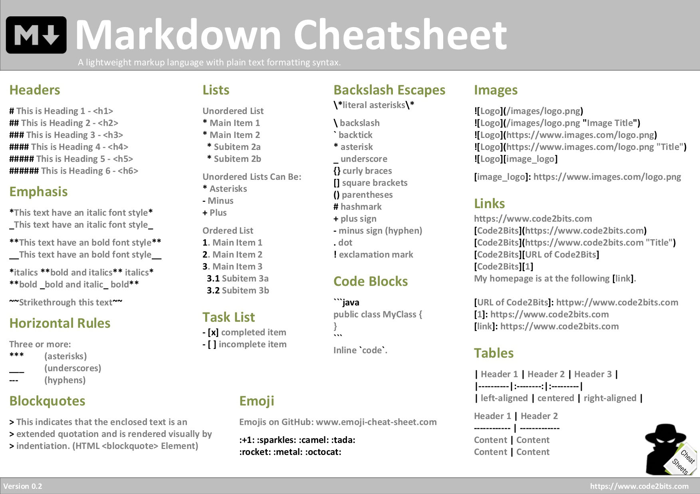

# Инструкция по работе с Git

Данная инструкция составлена для помощи себе в дальнейшей работе над составлением контроля версий. Установив Git  и VSCode, надо представиться системе всего один раз - ввести команду git config -- global user.name "nina ovtchinnikova" и вторую команду git config --global user.email "oookpo@rambler.ru"

## Создание репозитолрия

Для создания репозитория (говорят "инициализация") сначала создаем локальную папку, которую мы выбираем при открытии новой папки в VSCode   через "Файл"-Открыть новую папку", потом открываем соседнюю закладку в проводнике и создаем терминал, затем нужно ввести в терминале команду:

    git init

# Начало работы 

Чтобы создать "сохранение" необходимо сначало добавить файл к отслеживанию версионности, а потом зафиксировать это изменение.

### Добавление версионности

Чтобы после "ctrl+S" сохранить изменение не только в файле, но и в Git, добавляем команду

    git add

с обязательным названием файла через пробел

### Создание коммита
 
Чтобы закрепить, "закоммитить" состояние Git, создаем команду

    git commit -m ""

где внутри кавычек описываем сделанный 1 шаг, а не несколько

### Просмотр состояния

Чтобы просмотреть состояние git вводим команду

    git status

### Просмотр журнала измений

    git log

показывает все наши версиии, измененные в git c указанием кода изменений, удобно пользоваться git log --oneline, git log --all --oneline, где еще и видно в ветке ли master мы находимся

### Перключение между версиями

    git checkout

существует для навигации, git checkout maser возвращает в основную ветку при переключении между разными версиями Git, версии имеют числово-буквенный вид, достаточно первых 4 символов для указания места, которое изменялось

### Просмотр изменений

    git diff

показывает разницу между текущим файлом и сохраненным, испотьзуя git log перед git diff, видим  количество сохранений 

# Синтаксис языка MarkDown #

# Чтобы использовать альтернативно курсив или полужирный, надо _часть текста обрамить знаком нижнего подчеркивания или *знаком звездочки*_

